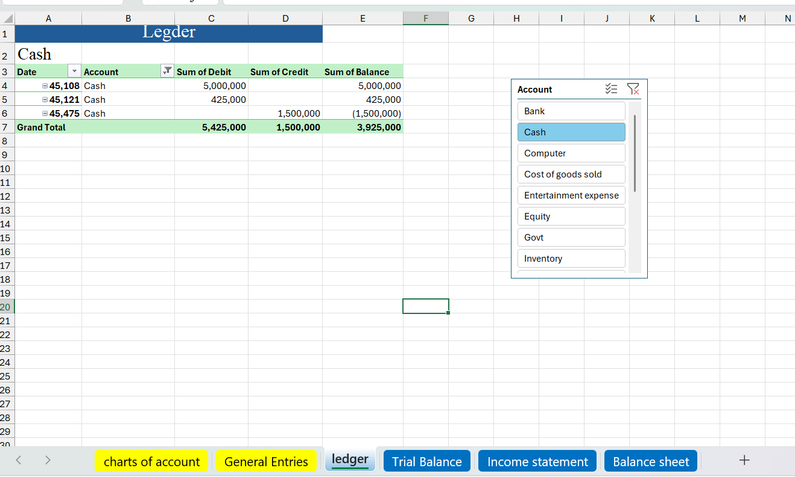
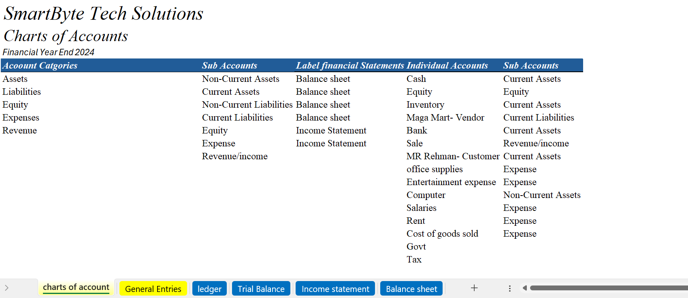

# Automated-Bookkeeping-System-Excel
# Automated Bookkeeping System in Excel A dynamic accounting system for small businesses built in Microsoft Excel. It includes automated journal entries, ledgers, and financial statements for a fictional tech company — SmartByte Tech Solutions.
## ✅ Features
- General Journal with drop-downs
- Ledger auto-updated via formulas
- Trial Balance, Income Statement, Balance Sheet
- Clean UI for beginners & students
## 🧠 Skills Demonstrated
- Bookkeeping & Financial Accounting
- Excel Automation (SUMIFS, XLOOKUP, Data Validation)
- Pivot Tables, Conditional Formatting
- Financial Reporting Standards (GAAP/IFRS logic)
  ## 📸 Screenshots

### 📗 General Ledger  
Automated ledger generated from journal entries using Excel formulas.

---

### 🧮 Chart of Accounts  
All accounts categorized and dynamically linked across the system.

---

### 📊 Summary Reports  
Automated Bookkeeping template Summary reports

